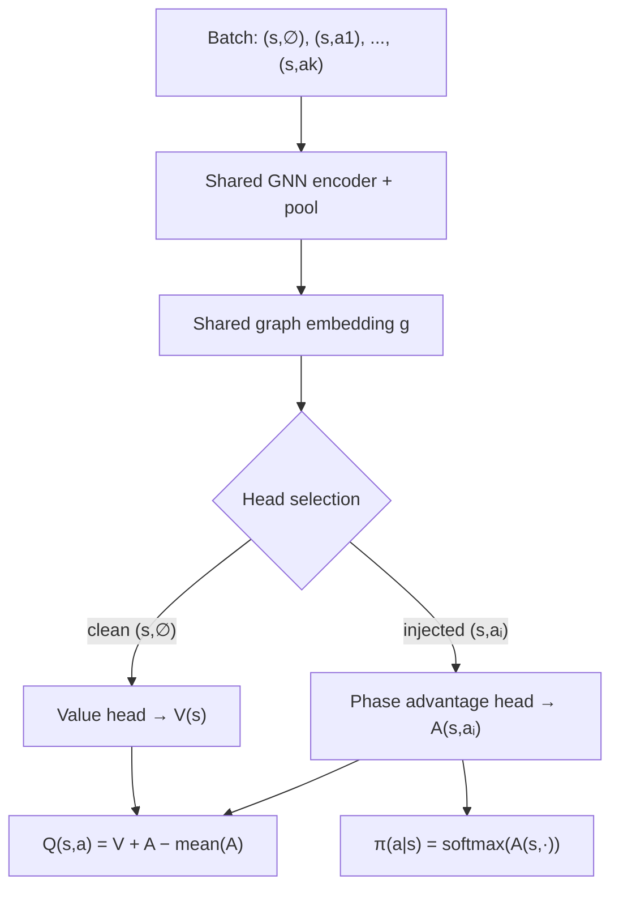

# PQN — Policy Q-Network (Dueling architecture)

Design/reference doc for **PQN**, a unified value–policy learning framework
for variable, state-dependent action spaces. This is the intended successor
to Net A (`GNN_DQN`, see [NetworkArchitectures.md](NetworkArchitectures.md)):
it keeps the exact same shared foundation — `GraphAdapter` base graph,
`Encoder`, `ActionGraphBuilder` injection, per-phase heads — and extends it
into a **Dueling** network that produces both a Q-value and a policy from one
shared representation of state-action quality.

This doc is the summarization we build the structure from; **no code yet**,
it captures the current design direction and the intuition behind it.

---

## 1. Motivation — why not a fixed output vector

Risk's action space is unlike Atari / Chess / Go. At every state we have a set
of legal actions

$$A_{legal}(s) = \{a_1, a_2, \ldots, a_k\}$$

where

- $k$ changes every state,
- most conceivable actions do not exist at a given state,
- a fixed output neuron per possible action is wasteful and rigid.

So the network never maps $Q(s) \rightarrow \text{vector}$. Instead it scores
**one state-action pair at a time**:

$$f_\theta(s, a) \rightarrow \text{scalar}.$$

This is already exactly how Net A works — `ActionGraphBuilder` injects one
action into the graph, the `Encoder` runs, and a per-phase head emits one
scalar. PQN inherits this unchanged.

---

## 2. Batch of legal actions

During inference we build one batch containing **every** legal action:

$$(s, a_1),\ (s, a_2),\ \ldots,\ (s, a_k)$$

The same state repeats while only the injected action changes; the network
scores the whole batch in one pass (`Batch.from_data_list`, as in
`GNN_DQN_Agent`). Advantages of this representation:

- works with an arbitrary, dynamic legal-action count,
- no gigantic output layer,
- naturally supports graph networks,
- naturally supports variable action spaces.

This representation is the foundation of the whole algorithm.

---

## 3. The original observation — DQN and PPO converge on the same quantity

Comparing DQN and PPO, both ultimately produce **a score for every legal
action**:

- DQN reads it as $Q(s, a)$,
- PPO reads it as a **logit** (pre-Softmax).

If two different networks produce almost the same quantity, why train two
networks? That question is the seed of PQN.

---

## 4. Unified scoring function

PQN produces **one** score $f_\theta(s, a)$ with two interpretations:

- **Bellman learning:** $Q(s, a) = f(s, a)$,
- **Policy:** $\pi(a \mid s) = \operatorname{softmax}\big(f(s, \cdot)\big)$.

The same values are simultaneously Q-values and policy logits — essentially a
**Boltzmann policy** over the scoring function.

---

## 5. From Policy Gradient to a replay-based objective

The original plan was DQN + Actor-Critic (Bellman loss + policy-gradient
loss). A key realization changed the framing:

Policy Gradient is derived **only for on-policy data**. PQN is off-policy —
the replay buffer stores only

$$(s, a, r, s', \text{done})$$

with **no** stored probabilities or logits. During training everything (value,
advantages, policy) is **recomputed from the current network**. Therefore PQN
is not really Actor-Critic. The policy loss is instead viewed as a
**replay-based policy improvement objective**, not a policy-gradient estimate.

---

## 6. Cross-entropy interpretation of the policy loss

The policy loss

$$-A \, \log \pi(a \mid s)$$

is **not** justified via the Policy Gradient theorem. It is interpreted as
**advantage-weighted cross entropy**:

- if $A > 0$ → increase the probability of action $a$,
- if $A < 0$ → decrease it.

Exactly the behavior we want, and independent of the policy-gradient
derivation.

---

## 7. Major architectural improvement — go Dueling

Instead of standard DQN, PQN uses **Dueling DQN**, which naturally provides the
two quantities we need. Rather than predicting $Q(s, a)$ directly, the network
predicts

- a **state value** $V(s)$, and
- an **action advantage** $A(s, a)$,

and combines them:

$$Q(s, a) = V(s) + A(s, a) - \operatorname{mean}_{a'} A(s, a').$$

This matches PQN's needs perfectly: the value stream and the advantage stream
are precisely the two things the unified objective consumes.

---

## 8. New batch structure — add the clean state

The batch gains one extra "clean" sample at the front:

$$(s, \varnothing),\ (s, a_1),\ (s, a_2),\ \ldots,\ (s, a_k)$$

where $(s, \varnothing)$ is the state **without any action injected** — the
bare `GraphAdapter` base graph. The rest are the usual injected action graphs.

---

## 9. Special meaning of the clean sample

- $(s, \varnothing)$ carries only the state → routed to a dedicated **Value
  head** → outputs $V(s)$.
- $(s, a_i)$ carries an injected action → routed to the corresponding
  **Advantage head** (the existing per-phase heads) → outputs $A(s, a_i)$.

One forward pass yields $V(s)$ **and** all $A(s, a_i)$.

---

## 10. Why this is elegant

A single forward pass computes everything required — $V(s)$, the advantages,
the Q-values, and the policy logits. **No second network pass** is needed.

---

## 11. Network architecture

```
Batch:
  (s, ∅), (s, a1), (s, a2), ..., (s, ak)

        ↓
Shared GNN (Encoder + pool)          ← unchanged from Net A
        ↓
Shared graph embedding g
        ↓
Head selection:
  clean state (s, ∅)   → Value head            → V(s)
  action-injected      → Phase Advantage head  → A(s, a)
        ↓
Q(s, a) = V(s) + A(s, a) − mean_a' A(s, a')
        ↓
π(a | s) = softmax( A(s, ·) )
```



---

## 12. Phase heads — one extra head only

Risk already has one head per action phase (`ScoringHead` for
`REINFORCE_PLACE` / `ATTACK` / `OCCUPY` / `FORTIFY`, `TradeInHead` for
`TRADE_IN` — see [heads.py](../risk/learning/heads.py)). The per-phase heads
become the **advantage heads** — their output scalar is reinterpreted as
$A(s, a)$ instead of $Q(s, a)$. PQN adds exactly **one new head**: the
**Value head** that reads the clean state's pooled embedding and emits $V(s)$.
The architecture stays extremely clean.

---

## 13. Bellman loss — Double-DQN with Q-target

Identical to **Dueling Double DQN**. The target network is a frozen copy of the
online network and is used **only** for the Bellman target.

Select the next action with the **online** net:

$$a^* = \arg\max_{a'} Q_{online}(s', a')$$

Evaluate it with the **target** net:

$$y = r + \gamma\,(1 - \text{done})\, Q_{target}(s', a^*)$$

Loss:

$$L_Q = \big(Q_{online}(s, a) - y\big)^2$$

Target update, periodic (hard) or soft:

$$\theta_{target} \leftarrow \theta_{online}
\qquad\text{or}\qquad
\theta_{target} \leftarrow \tau\,\theta_{online} + (1 - \tau)\,\theta_{target}$$

---

## 14. Policy — read it straight from the advantages

Since $V(s)$ and $\operatorname{mean}(A)$ are **constant across actions** and
Softmax ignores constant shifts:

$$\pi(a \mid s) = \operatorname{softmax}\big(Q(s, \cdot)\big)
= \operatorname{softmax}\big(A_{online}(s, \cdot)\big).$$

The policy can be computed **directly from the advantage stream** — no need to
reconstruct $Q$ first. Only the **online** network is used for the policy.

---

## 15. Policy improvement loss

Compute the **RL advantage** using the **online** Value head:

$$A_{RL} = r + \gamma\,(1 - \text{done})\, V_{online}(s') - V_{online}(s)$$

Then apply advantage-weighted cross entropy:

$$L_\pi = -\,A_{RL}\, \log \pi_{online}(a \mid s)$$

**Two distinct meanings of "advantage"** appear and must not be confused:

- $A_{network} = A_{online}(s, a)$ — the dueling **advantage stream** (a
  network output), used for the policy logits.
- $A_{RL} = r + \gamma V(s') - V(s)$ — the **reinforcement-learning
  advantage** (a training signal), used as the cross-entropy weight.

Initially $A_{RL}$ is the weight. A later research question is whether the
network advantage itself can serve as the policy target.

The target network does **not** participate in the policy loss, nor in
$A_{RL}$: the actor improves against the **current** value estimate, not a
delayed one.

---

## 16. Total loss

$$L = \lambda_Q\, L_Q + \lambda_\pi\, L_\pi + \lambda_H\, H(\pi)$$

Entropy $H(\pi)$ is optional. Suggested first experiment:

$$\lambda_Q = 1,\qquad \lambda_\pi = 0.1,\qquad \lambda_H = 0.01.$$

---

## 17. Why the target network is still essential

The online network is optimized by **two** objectives (Bellman + policy). If
the Bellman target moved with the online network, training would be even less
stable than plain DQN. So the target net matters **more** here, not less.

Clean separation of roles:

- **Online network** — learns both the values and the policy.
- **Target network** — a frozen full copy (shared GNN + value head + advantage
  heads); stabilizes **only** the Bellman target, never used for the policy or
  for $A_{RL}$.

```
Online PQN  ──(periodic / soft copy)──▶  Target PQN
  learns V, A, Q, π                        frozen copy
  defines policy                           only Q_target(s', a*)
```

---

## 18. Why Dueling fits PQN

The original plan needed **three** networks: $Q$, target $Q$, and a separate
$V$. Dueling already contains a value stream, so PQN gets $V$, $A$, and $Q$
with almost no extra structure. PQN is therefore best seen as an **extension of
Dueling DQN**, not of vanilla DQN.

---

## 19. Replay buffer

Stores only

$$(s, a, r, s', \text{done})$$

— no old logits, no old probabilities, no old policy. During training everything
is recomputed from the current networks:

- $V_{online}$, $A_{online}$, $Q_{online}$, $\pi_{online}$ (online net),
- $Q_{target}$ (target net).

This preserves DQN's replay efficiency.

---

## 20. Why this may work

- **Bellman learning** teaches **absolute** action values — "what is the
  expected return?"
- **Cross entropy** teaches **relative ordering** of actions — "which action
  should get higher probability?"

Together they may produce better ranking among many similar legal actions than
either objective alone.

---

## 21. Expected advantages

**vs. PPO:** replay buffer, better sample efficiency, simpler training, no
rollout storage, no clipping, no stored old-policy probabilities.

**vs. DQN:** explicit policy learning, improved action ranking, better
discrimination between many similar legal actions.

---

## 22. Research questions

1. Does replay-based policy improvement actually help learning?
2. Does cross entropy improve action ranking beyond Bellman learning?
3. Is PQN more sample-efficient than PPO?
4. Does PQN converge faster than DQN?
5. Does explicit policy learning improve graph-based Risk agents?
6. Can $A_{network}$ eventually replace $A_{RL}$ in the policy loss?
7. Can the Value head eventually be removed by deriving
   $V(s) = \mathbb{E}_\pi[Q]$, or should it stay an explicit stream?

---

## 23. Core intuition

PQN is a **unified state-action scoring framework**. One network learns how
good every legal action is; the same scores serve **both** Bellman learning and
policy learning. It combines:

1. **Dueling DQN value learning** — $Q = V + A - \operatorname{mean}(A)$,
2. **Policy from the same advantages** — $\pi = \operatorname{softmax}(A)$,
3. **Double-DQN target stabilization** — online chooses, target evaluates,
4. **Replay-based policy improvement** — $-A_{RL}\,\log \pi(a \mid s)$.

The **target** network stabilizes only the Bellman part; the **online** network
defines both the value estimates and the policy — one shared representation of
state-action quality over a sparse, dynamic, graph-based legal action space.
```