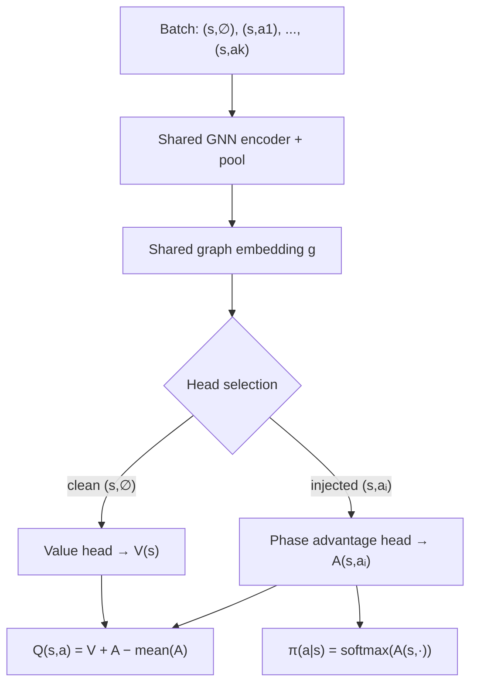

# PQN — Policy Q-Network (Dueling architecture)

Design/reference doc for **PQN**, a unified value–policy learning framework
for variable, state-dependent action spaces. This is the intended successor
to Net A (`GNN_DQN`, see [NetworkArchitectures.md](NetworkArchitectures.md)):
it keeps the exact same shared foundation — `GraphAdapter` base graph,
`Encoder`, `ActionGraphBuilder` injection, per-phase heads — and extends it
into a **Dueling** network that produces both a Q-value and a policy from one
shared representation of state-action quality.

This doc is the summarization we build the structure from; **no code yet**,
it captures the current design direction and the intuition behind it.

---

## 1. Motivation — why not a fixed output vector

Risk's action space is unlike Atari / Chess / Go. At every state we have a set
of legal actions

$$A_{legal}(s) = \{a_1, a_2, \ldots, a_k\}$$

where

- $k$ changes every state,
- most conceivable actions do not exist at a given state,
- a fixed output neuron per possible action is wasteful and rigid.

So the network never maps $Q(s) \rightarrow \text{vector}$. Instead it scores
**one state-action pair at a time**:

$$f_\theta(s, a) \rightarrow \text{scalar}.$$

This is already exactly how Net A works — `ActionGraphBuilder` injects one
action into the graph, the `Encoder` runs, and a per-phase head emits one
scalar. PQN inherits this unchanged.

---

## 2. Batch of legal actions

During inference we build one batch containing **every** legal action:

$$(s, a_1),\ (s, a_2),\ \ldots,\ (s, a_k)$$

The same state repeats while only the injected action changes; the network
scores the whole batch in one pass (`Batch.from_data_list`, as in
`GNN_DQN_Agent`). Advantages of this representation:

- works with an arbitrary, dynamic legal-action count,
- no gigantic output layer,
- naturally supports graph networks,
- naturally supports variable action spaces.

This representation is the foundation of the whole algorithm.

---

## 3. The original observation — DQN and PPO converge on the same quantity

Comparing DQN and PPO, both ultimately produce **a score for every legal
action**:

- DQN reads it as $Q(s, a)$,
- PPO reads it as a **logit** (pre-Softmax).

If two different networks produce almost the same quantity, why train two
networks? That question is the seed of PQN.

---

## 4. Unified scoring function

PQN produces **one** score $f_\theta(s, a)$ with two interpretations:

- **Bellman learning:** $Q(s, a) = f(s, a)$,
- **Policy:** $\pi(a \mid s) = \operatorname{softmax}\big(f(s, \cdot)\big)$.

The same values are simultaneously Q-values and policy logits — essentially a
**Boltzmann policy** over the scoring function.

---

## 5. From Policy Gradient to a replay-based objective

The original plan was DQN + Actor-Critic (Bellman loss + policy-gradient
loss). A key realization changed the framing:

Policy Gradient is derived **only for on-policy data**. PQN is off-policy —
the replay buffer stores only

$$(s, a, r, s', \text{done})$$

with **no** stored probabilities or logits. During training everything (value,
advantages, policy) is **recomputed from the current network**. Therefore PQN
is not really Actor-Critic. The policy loss is instead viewed as a
**replay-based policy improvement objective**, not a policy-gradient estimate.

---

## 6. Cross-entropy interpretation of the policy loss

The policy loss

$$-A \, \log \pi(a \mid s)$$

is **not** justified via the Policy Gradient theorem. It is interpreted as
**advantage-weighted cross entropy**:

- if $A > 0$ → increase the probability of action $a$,
- if $A < 0$ → decrease it.

Exactly the behavior we want, and independent of the policy-gradient
derivation.

---

## 7. Major architectural improvement — go Dueling

Instead of standard DQN, PQN uses **Dueling DQN**, which naturally provides the
two quantities we need. Rather than predicting $Q(s, a)$ directly, the network
predicts

- a **state value** $V(s)$, and
- an **action advantage** $A(s, a)$,

and combines them:

$$Q(s, a) = V(s) + A(s, a) - \operatorname{mean}_{a'} A(s, a').$$

This matches PQN's needs perfectly: the value stream and the advantage stream
are precisely the two things the unified objective consumes.

---

## 8. New batch structure — add the clean state

The batch gains one extra "clean" sample at the front:

$$(s, \varnothing),\ (s, a_1),\ (s, a_2),\ \ldots,\ (s, a_k)$$

where $(s, \varnothing)$ is the state **without any action injected** — the
bare `GraphAdapter` base graph. The rest are the usual injected action graphs.

---

## 9. Special meaning of the clean sample

- $(s, \varnothing)$ carries only the state → routed to a dedicated **Value
  head** → outputs $V(s)$.
- $(s, a_i)$ carries an injected action → routed to the corresponding
  **Advantage head** (the existing per-phase heads) → outputs $A(s, a_i)$.

One forward pass yields $V(s)$ **and** all $A(s, a_i)$.

---

## 10. Why this is elegant

A single forward pass computes everything required — $V(s)$, the advantages,
the Q-values, and the policy logits. **No second network pass** is needed.

---

## 11. Network architecture

```
Batch:
  (s, ∅), (s, a1), (s, a2), ..., (s, ak)

        ↓
Shared GNN (Encoder + pool)          ← unchanged from Net A
        ↓
Shared graph embedding g
        ↓
Head selection:
  clean state (s, ∅)   → Value head            → V(s)
  action-injected      → Phase Advantage head  → A(s, a)
        ↓
Q(s, a) = V(s) + A(s, a) − mean_a' A(s, a')
        ↓
π(a | s) = softmax( A(s, ·) )
```



---

## 12. Phase heads — one extra head only

Risk already has one head per action phase (`ScoringHead` for
`REINFORCE_PLACE` / `ATTACK` / `OCCUPY` / `FORTIFY`, `TradeInHead` for
`TRADE_IN` — see [heads.py](../risk/learning/heads.py)). The per-phase heads
become the **advantage heads** — their output scalar is reinterpreted as
$A(s, a)$ instead of $Q(s, a)$. PQN adds exactly **one new head**: the
**Value head** that reads the clean state's pooled embedding and emits $V(s)$.
The architecture stays extremely clean.

---

## 13. Bellman loss — Double-DQN with Q-target

Identical to **Dueling Double DQN**. The target network is a frozen copy of the
online network and is used **only** for the Bellman target.

Select the next action with the **online** net:

$$a^* = \arg\max_{a'} Q_{online}(s', a')$$

Evaluate it with the **target** net:

$$y = r + \gamma\,(1 - \text{done})\, Q_{target}(s', a^*)$$

Loss (Smooth L1 / Huber, matching Dueling DQN's existing choice —
`Docs/DuelingDQN.md`'s "Loss" section and §24.C below; **not** plain squared
error, which an earlier draft of this section stated):

$$L_Q = \operatorname{SmoothL1}\big(Q_{online}(s, a),\ y\big)$$

Target update, periodic (hard) or soft:

$$\theta_{target} \leftarrow \theta_{online}
\qquad\text{or}\qquad
\theta_{target} \leftarrow \tau\,\theta_{online} + (1 - \tau)\,\theta_{target}$$

---

## 14. Policy — read it straight from the advantages

Since $V(s)$ and $\operatorname{mean}(A)$ are **constant across actions** and
Softmax ignores constant shifts:

$$\pi(a \mid s) = \operatorname{softmax}\big(Q(s, \cdot)\big)
= \operatorname{softmax}\big(A_{online}(s, \cdot)\big).$$

The policy can be computed **directly from the advantage stream** — no need to
reconstruct $Q$ first. Only the **online** network is used for the policy.

---

## 15. Policy improvement loss

Compute the **RL advantage** using the **online** Value head:

$$A_{RL} = r + \gamma\,(1 - \text{done})\, V_{online}(s') - V_{online}(s)$$

Then apply advantage-weighted cross entropy:

$$L_\pi = -\,A_{RL}\, \log \pi_{online}(a \mid s)$$

**Two distinct meanings of "advantage"** appear and must not be confused:

- $A_{network} = A_{online}(s, a)$ — the dueling **advantage stream** (a
  network output), used for the policy logits.
- $A_{RL} = r + \gamma V(s') - V(s)$ — the **reinforcement-learning
  advantage** (a training signal), used as the cross-entropy weight.

Initially $A_{RL}$ is the weight. A later research question is whether the
network advantage itself can serve as the policy target.

The target network does **not** participate in the policy loss, nor in
$A_{RL}$: the actor improves against the **current** value estimate, not a
delayed one.

---

## 16. Future development: entropy regularization

$$L = \lambda_Q\, L_Q + \lambda_\pi\, L_\pi - \lambda_H\, H(\pi)$$

The entropy term is **subtracted**, not added (an earlier draft of this
section had `+`). `L` is minimized by gradient descent, and it's the
subtraction that rewards *higher* entropy (more exploration) — adding it
would instead push the policy toward *lower* entropy, the opposite of the
intent. Matches §24.C's `- entropy_weight * entropy(pi)` below and PPO's
existing `- PPO_ENTROPY_COEF * entropy.mean()` (`ppo_agent.py`). Entropy
$H(\pi)$ is a future isolated experiment, not part of the initial PQN run:

$$\lambda_Q = 1,\qquad \lambda_\pi = 0.1,\qquad \lambda_H = 0.01.$$

---

## 17. Why the target network is still essential

The online network is optimized by **two** objectives (Bellman + policy). If
the Bellman target moved with the online network, training would be even less
stable than plain DQN. So the target net matters **more** here, not less.

Clean separation of roles:

- **Online network** — learns both the values and the policy.
- **Target network** — a frozen full copy (shared GNN + value head + advantage
  heads); stabilizes **only** the Bellman target, never used for the policy or
  for $A_{RL}$.

```
Online PQN  ──(periodic / soft copy)──▶  Target PQN
  learns V, A, Q, π                        frozen copy
  defines policy                           only Q_target(s', a*)
```

---

## 18. Why Dueling fits PQN

The original plan needed **three** networks: $Q$, target $Q$, and a separate
$V$. Dueling already contains a value stream, so PQN gets $V$, $A$, and $Q$
with almost no extra structure. PQN is therefore best seen as an **extension of
Dueling DQN**, not of vanilla DQN.

---

## 19. Replay buffer

Stores only

$$(s, a, r, s', \text{done})$$

— no old logits, no old probabilities, no old policy. During training everything
is recomputed from the current networks:

- $V_{online}$, $A_{online}$, $Q_{online}$, $\pi_{online}$ (online net),
- $Q_{target}$ (target net).

This preserves DQN's replay efficiency.

---

## 20. Why this may work

- **Bellman learning** teaches **absolute** action values — "what is the
  expected return?"
- **Cross entropy** teaches **relative ordering** of actions — "which action
  should get higher probability?"

Together they may produce better ranking among many similar legal actions than
either objective alone.

---

## 21. Expected advantages

**vs. PPO:** replay buffer, better sample efficiency, simpler training, no
rollout storage, no clipping, no stored old-policy probabilities.

**vs. DQN:** explicit policy learning, improved action ranking, better
discrimination between many similar legal actions.

---

## 22. Research questions

1. Does replay-based policy improvement actually help learning?
2. Does cross entropy improve action ranking beyond Bellman learning?
3. Is PQN more sample-efficient than PPO?
4. Does PQN converge faster than DQN?
5. Does explicit policy learning improve graph-based Risk agents?
6. Can $A_{network}$ eventually replace $A_{RL}$ in the policy loss?
7. Can the Value head eventually be removed by deriving
   $V(s) = \mathbb{E}_\pi[Q]$, or should it stay an explicit stream?

---

## 23. Core intuition

PQN is a **unified state-action scoring framework**. One network learns how
good every legal action is; the same scores serve **both** Bellman learning and
policy learning. It combines:

1. **Dueling DQN value learning** — $Q = V + A - \operatorname{mean}(A)$,
2. **Policy from the same advantages** — $\pi = \operatorname{softmax}(A)$,
3. **Double-DQN target stabilization** — online chooses, target evaluates,
4. **Replay-based policy improvement** — $-A_{RL}\,\log \pi(a \mid s)$.

The **target** network stabilizes only the Bellman part; the **online** network
defines both the value estimates and the policy — one shared representation of
state-action quality over a sparse, dynamic, graph-based legal action space.

---

## 24. Simple PQN implementation plan

PQN starts as a copy of Dueling DQN. The graph encoder, clean state row,
value head, phase advantage heads, legal-action batching, replay buffer, and
Double-DQN target calculation all stay the same. The only algorithmic additions
are Softmax over the Dueling advantages and one policy-loss term.

### A. What the copied Dueling heads output

For each decision, build exactly the same rows Dueling already builds:

```text
(s clean), (s + action_1), ..., (s + action_k)
```

The heads produce exactly the existing Dueling quantities:

```text
clean row:              V(s)
each action row:        A(s, a_i)
```

**`pqn.py` returns these two raw, uncombined — it does not fold them into
`Q` the way `Dueling_DQN.forward(...)` does.** No new head, no new
computation, just a different return signature: stop combining internally,
hand back the two pieces the heads already produced:

```python
def forward(self, ...) -> tuple[torch.Tensor, torch.Tensor]:
    ...
    return value_mean, advantage   # V(s) per decision group, A(s, a_i) per action row
```

This mirrors an existing convention in this codebase rather than inventing
a new one — `heads.py`'s own docstring: *"picking which head to call for
which legal actions is the agent's job, not the net's."* Combining `V` and
`A` into `Q`, and turning `A` into a policy, are exactly that kind of
orchestration — `pqn_agent.py` owns both, not `pqn.py`.

### B. What we calculate for `s` and `s'`

For the replayed transition `(s, a, r, s', done)`, use the same legal-action
reconstruction Dueling DQN already needs.

`pqn_net(...)` returns `(V, A)` per §A. `pqn_agent.py` combines them with
one small shared helper, reused at every call site below instead of being
rewritten three times — the same `scatter(..., reduce="mean")` pattern
already validated in `dueling_dqn.py`/`ppo_net.py`'s `_forward_grouped`,
not a new formula:

```python
def _combine_q(self, value: torch.Tensor, advantage: torch.Tensor,
               group_index: torch.Tensor) -> torch.Tensor:
    """Q(s, a_i) = V(s) + A(s, a_i) - mean_j(A(s, a_j)), grouped per decision."""
    n_groups = value.shape[0]
    advantage_mean = scatter(advantage, group_index, dim=0, dim_size=n_groups, reduce="mean")
    return value[group_index] + advantage - advantage_mean[group_index]
```

Reusing this one helper everywhere is deliberate: the old, removed
`value_mask is None` fallback (`Docs/DuelingDQN.md`'s dead-code review) got
this exact grouped-mean wrong once already by averaging over the wrong
rows. Writing it in one place instead of inline at three call sites is what
keeps that from happening again.

The policy also comes straight from `A`, per group, needing no `Q` at all:

```text
pi(a_i | s) = softmax(A(s, legal_actions))[i]
```

For the current state `s`:

```text
V_online(s), A_online(s, a_i) = pqn_net(s, legal_actions(s))   # forward pass
Q_online(s, a_i) = self._combine_q(V_online(s), A_online(s, .), group_index)
pi(a_i | s) = softmax(A_online(s, legal_actions))[i]
```

Then select the replayed action `a` to obtain `Q_online(s, a)` for the
Bellman prediction and `log(pi(a | s))` for the policy term.

For the next state `s'`, run both copied networks over the same legal-action
set:

```text
V_online(s'), A_online(s', a_i) = pqn_net(s', legal_actions(s'))          # online net
V_target(s'), A_target(s', a_i) = pqn_target_net(s', legal_actions(s'))   # target net

Q_online(s', a_i) = self._combine_q(V_online(s'), A_online(s', .), group_index)
Q_target(s', a_i) = self._combine_q(V_target(s'), A_target(s', .), group_index)

a* = argmax_a' Q_online(s', a')
Q_target(s', a*)        target-net evaluation for the Bellman target
V_online(s')            baseline bootstrap for the policy term
```

For a terminal transition, both next-state terms are zero. The target
network is used only through `Q_target(s', a*)` for the Bellman target;
`V_target(s')`/`A_target(s', .)` are otherwise unused — the policy and its
baseline always come from the online net, never the target net.

### C. Loss calculation

First keep Dueling's Bellman loss unchanged:

```text
y = r + gamma * (1 - done) * Q_target(s', a*)
q_loss = SmoothL1(Q_online(s, a), y)
```

Then calculate a TD advantage -- this is a learning weight, not the Dueling
advantage-head output:

```text
td_advantage = r + gamma * (1 - done) * V_online(s') - V_online(s)
```

Use it to increase the probability of actions that were better than expected
and decrease the probability of actions that were worse:

```text
td_advantage_weight = td_advantage.detach()  # stop_gradient(td_advantage)
policy_loss = mean(- td_advantage_weight * log pi(a | s))
total_loss = q_loss + policy_loss_weight * policy_loss
```

`stop_gradient(td_advantage)` is not another calculation: it is the PyTorch
operation `td_advantage.detach()`. It keeps the numerical TD advantage as a
fixed policy-loss weight while blocking policy-loss gradients from flowing into
`V_online(s)` or `V_online(s')`. The value head learns through `q_loss`;
the policy loss changes only the action-ranking outputs. Keep this in a small
`_policy_loss(td_advantage, log_pi_taken)` agent helper so a focused regression
test can protect the detach contract. Begin with an explicit
policy-loss weight in `train_constants.py`, log it, and keep every other
Dueling setting the same for the first comparison run. **Future development:**
test entropy regularization only as a separate experiment after this baseline
has a meaningful comparison window.

During training, sample actions from `pi`; during evaluation, select the
largest-probability action. That is the full behavioral change from Dueling
DQN.

**Not yet specified, deliberately deferred until implementation starts:**
`pqn_*` diagnostic fields, checkpoint format, and test coverage. Start from
Dueling's existing shape (`Docs/DuelingDQN.md`'s "Loss" section,
`Docs/Trainer.md`'s generic `progress_metrics()`/`last_update_metrics`
hooks) rather than re-deriving it from scratch. Worth calling out explicitly:
PQN trains two losses through one shared encoder, the same shape that made
PPO's actor/critic split need separate encoder-gradient-norm diagnostics
(`ppo_policy_encoder_grad_norm`/`ppo_value_encoder_grad_norm`,
`Docs/PPO.md`) to test a critic-dominance hypothesis — worth planning for
the same split here rather than only discovering the need after an
unexplained training instability, as happened with PPO.

### D. Implementation status

§A-C above are implemented as written: [pqn.py](../risk/learning/pqn.py)
(the network, returning raw `(value_mean, advantage)`) and
[pqn_agent.py](../risk/learning/pqn_agent.py) (`PQN_Agent` — `_combine_q`,
`_current_state_terms`, `_next_state_terms`, `train_step`), wired into
`build_learner_agent("PQN", ctx)` in `trainer.py`. `PQN_POLICY_LOSS_COEF`
(the initial policy-loss weight from §24.C, `0.1`) lives in `train_constants.py`.
`pqn_agent.py` has no `epsilon` — `act()` always samples/argmaxes the
`softmax(A)` policy, matching PPO's "no epsilon-greedy" pattern rather than
Dueling's.

`last_update_metrics` follows Dueling's shape rather than PPO's split
encoder-gradient-norm diagnostics for now (`pqn_q_loss`, `pqn_policy_loss`,
`pqn_total_loss`, `pqn_td_error_mean`/`_abs_mean`, `pqn_td_advantage_mean`/
`_abs_mean`, `pqn_q_value_mean`, `pqn_value_mean`, `pqn_target_q_mean`,
`pqn_grad_norm`/`_clipped`); `progress_metrics()` reports
`pqn_replay_buffer_size`/`pqn_train_steps_since_target_sync`. Revisit the
encoder-gradient-norm split called out above if a real training run shows
the same critic-dominance-style instability PPO had.

Covered by `Temp/tests/test_pqn.py` (network/`_combine_q`/act/threshold/
checkpoint round-trip) and smoke-tested through a real `Trainer.train()`
run. **Not yet run as a full training experiment** — no comparison against
Dueling DQN or PPO exists yet; the research questions in §22 remain open.
