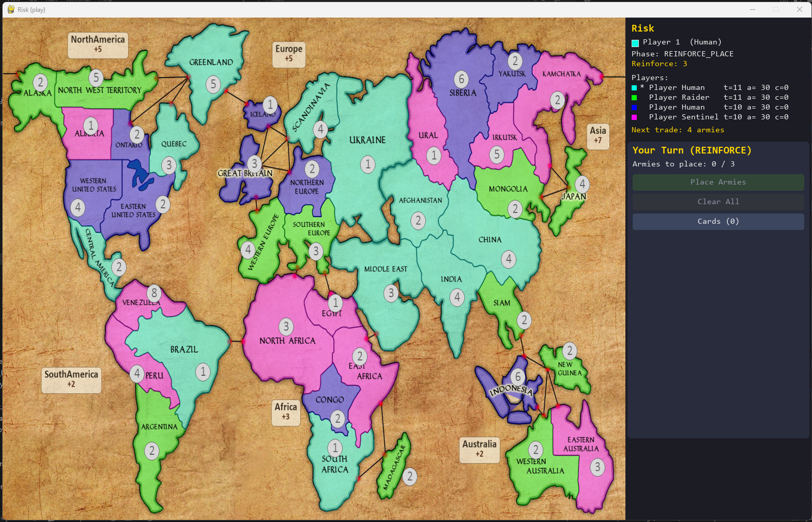
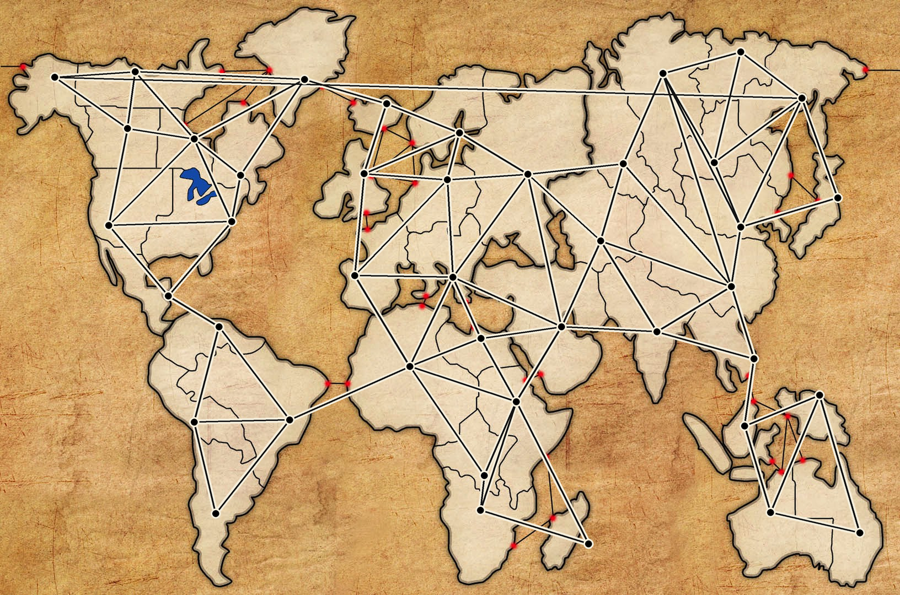
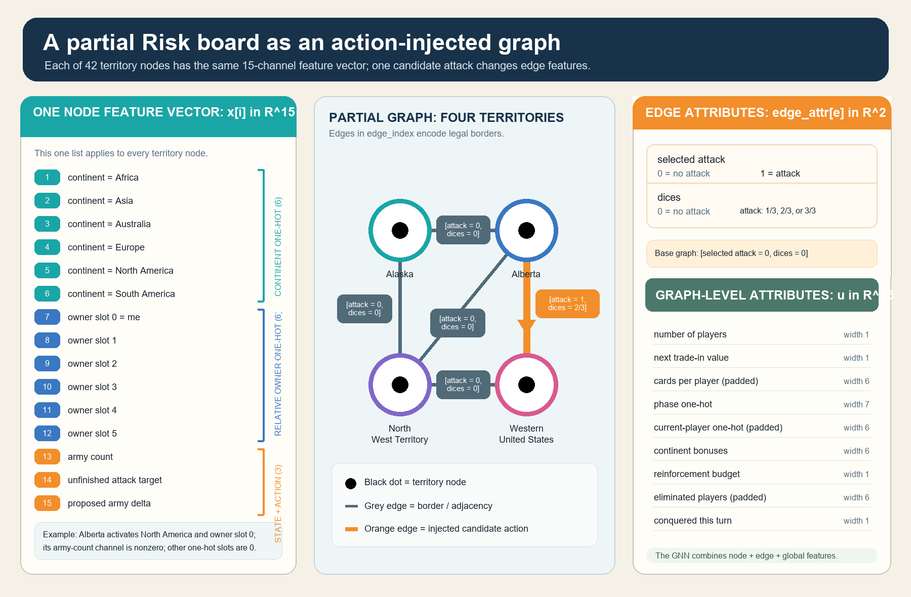
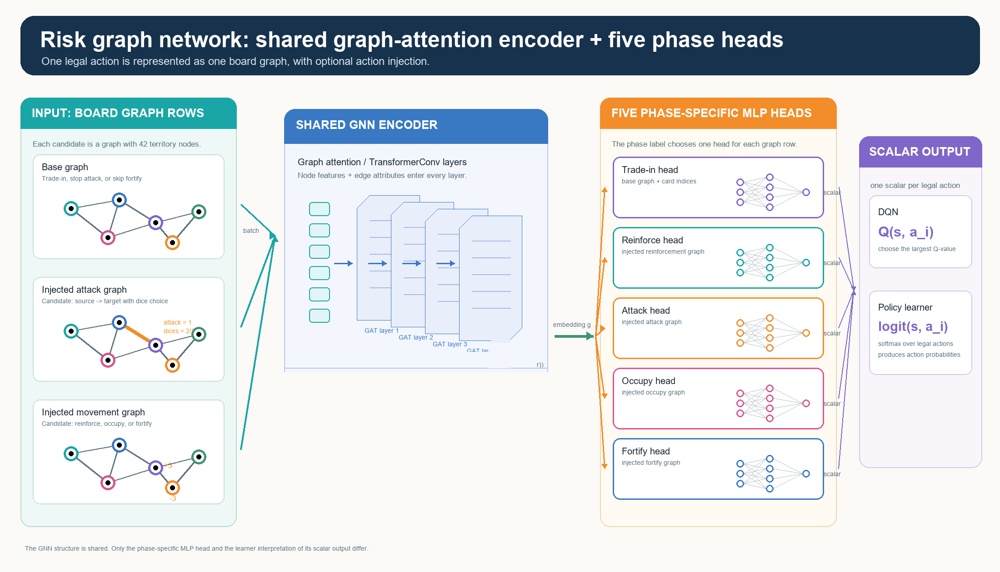

# Learning to Play Risk with Action-Injected Graph Neural Networks

A graph-attention reinforcement-learning approach to Risk, compared across
DQN, Dueling DQN, and PPO.

Practical Deep Learning for Science · Prof. Eilam Gross · Gilad Markman · 2026

The print-poster header also carries the supplied Weizmann Institute of Science logo.

> **Each legal Risk move is injected into the board graph. One shared
> graph-attention encoder scores the resulting state–action graph.**
>
> **That encoder is trained through reinforcement learning — compared across
> DQN, Dueling DQN, and PPO — so only the learning objective changes between
> them.**

---

## How Risk is played

Risk is played on a 42-territory world map, and **the goal is to conquer the
entire board by eliminating every opponent**. Territories change hands
through dice combat: the attacker and defender each roll one die per army
committed (up to three for the attacker, two for the defender), the highest
dice are compared pair by pair, and the losing side removes one army each
round — repeated until the attacker retreats or the defending territory is
emptied and conquered. Each turn steps through five phases in order:
**trade-in** cards for bonus armies, **reinforce** with new armies,
**attack** neighbouring territories, **occupy** a territory just conquered,
and **fortify** by regrouping armies before ending the turn.

**Figure 1.** The playable Risk board.

---

## The problem: an enormous, mostly-illegal, structured action space

An attack chooses a source territory, an adjacent enemy target, and a dice
count; reinforce, occupy, and fortify each choose a territory and an army
amount. Enumerated over 42 territories and their borders, the nominal action
space is huge — and in any given state, almost all of it is illegal. A
fixed-size Q-output network must still carry one output per nominal action,
learn over combinations that are rarely or never legal, and mask out
everything else at every decision.

The state itself resists a flat vector, too: ownership, armies, continents,
cards, and borders are relational — whether a move is good depends on who is
adjacent, who is strong, and which continent is contested. Flattening that
into one fixed-length vector throws the relational structure away.

---

## The idea: represent the board as a graph, inject the action, score only what's legal

Represent the board as a graph — nodes are territories, edges are borders —
so the relational structure survives. For each **legal** action, inject it
directly into that graph as a state–action pair and let one shared encoder
score it. No fixed action-output layer, no masking: the network only ever
sees candidates that can actually be taken.

**Figure 2.** The board as a graph: 42 territory nodes and 83 undirected
borders, stored as 166 directed edges for message passing.

~~~text
X: node features       [42 × 15]
E: edge features       [166 × 2]
u: global features     [1 × 35]
~~~

---

## Injecting a candidate action into the graph

For an attack, the selected directed border receives an orange edge feature
such as `[attack = 1, dice = 2/3]`. For reinforce, occupy, and fortify,
affected territory rows receive a proposed army-change feature. Skip actions
use an unmodified graph copy. The network sees **the board plus the specific
candidate move**.

**Figure 3.** One legal attack changes the selected border before graph
attention (orange = injected candidate action). Node features describe
territories, edge features describe borders and attacks, and global features
describe phase-level constraints.

1. **Rules enumerate legal candidate actions.**
2. **Injection marks one candidate action in the graph.**
3. **The GNN returns one score for that state–action graph.**

**Central novelty.** A legal move is represented as a controlled perturbation
of the board graph rather than as an index in a fixed action-output layer.
One shared encoder can therefore score the current state and each candidate
action together.

---

## One shared graph encoder, five action-phase heads

Every legal candidate enters the same graph-attention encoder. Four residual
`TransformerConv` layers exchange information along Risk borders, so a
territory can weigh different neighbours differently. Mean and max pooling
summarize territory embeddings, global state is appended, and the current
phase chooses one small MLP head. The representation is shared while the
learning objective changes.

**Figure 4.** A legal action becomes one graph row. The shared encoder is
followed by the relevant trade-in, reinforce, attack, occupy, or fortify
head. DQN treats the scalar as `Q(s, a)`; a policy learner uses legal-action
logits and a value estimate.

| Learner | Legal-action output | Training signal |
|---|---|---|
| DQN | `Q(s, a)` | replayed Double-DQN targets |
| Dueling DQN | state value + relative advantage | replayed Double-DQN targets |
| PPO | policy logit and state value | on-policy clipped updates |

---

## Sparse attention and reward shaping

### 4. How GATN attention uses the injected action

GATN attends only across neighbouring territories: `Q` represents the
receiving territory, `K` determines a neighbour's relevance, and `V` is the
message that neighbour sends. The panel reduces the calculation to:

~~~text
Q × K → α (attention weight)
α × V → weighted neighbour message
~~~

Messages are summed by receiving territory and passed to the next GATN layer;
no all-territory attention matrix is formed. The injected action changes `K`
and `V` on its selected border, changing that border's attention weight and
message.

### 5. Reward shaping behind DQN_103

Risk delivers the win/loss signal only after a long, stochastic game, so
DQN_103 paired the terminal objective with bounded, phase-aware local rewards.
This panel intentionally documents the **historical DQN_103 reward regime**:
terminal win/loss was `+100 / -100` and dense shaping used scale `0.1`, not
the current retuned values.

| Phase | Key DQN_103 signal | What it teaches |
|---|---|---|
| Terminal | +100 win / -100 loss (unscaled) | Winning remains the objective. |
| Trade-in | ±0.30 optional trade; +0.60 owned-territory card | Wait unless the trade creates value. |
| Reinforce | Enemy-border placement + strength vs. weakest neighbour; -0.8 safe interior | Build a border that can attack. |
| Attack | Good odds + army exchange; +1.2 conquest; +4 continent; elimination bonus | Use strong odds and profitable battles. |
| Occupy + fortify | Move armies into a capture / toward an enemy border; penalize weakening it | Keep force where opponents can attack. |
| Board progress | 20 Δ territory + 0.1 Δ army + 2.5 Δ continent; loss penalty | Reward gains that survive the full round. |

In the historical run:

    reward = terminal
           + 0.1 × clip[-10,+10](trade + reinforce + attack + occupy + fortify)
           + 0.1 × board_progress_after_opponents

The terminal term is neither clipped nor scaled. Local shaping applies only to
learner actions; board progress is separately scaled, **not clipped**, at the
learner turn boundary after every opponent has played.

---

## Results: training + held-out evaluation

Same legal-action generator · Same injected graph representation
Same heuristic-opponent roster · Randomized learner seat and player count
Compared against cumulative learner turns · Held-out evaluation reported separately

| DQN | Learner comparison | DQN_103 evaluation |
|---|---|---|
| Current DQN data | Reserved for matched DQN vs. Dueling DQN vs. PPO chart | Top five checkpoints across 3–6 players |
|  |  |  |

**Figure 6.** Top five DQN_103 checkpoints on the fixed
checkpoint-selection suite, separated by total player count. Each checkpoint
is tested in 54 games: three seeds, every learner seat, epsilon 0, and a
2,000-step game cap. The latest checkpoint, `ep006700`, wins 46 of 54 games
(85.2%) with zero timeouts. This is DQN-only checkpoint-selection evidence.

**Figure 7.** The middle results card is reserved for a matched DQN,
Dueling-DQN, and PPO comparison. Until that chart is available, its existing
graphic is a clearly labelled layout placeholder rather than a result.

---

> **Action injection converts a changing legal-action set into a graph
> scoring problem: the GNN evaluates the board and the proposed move
> together.**

**Limitations**

- Risk outcomes are stochastic — held-out evaluation and uncertainty matter
  more than a smoothed training curve.
- One injected graph per legal candidate is expressive but costs more than a
  single fixed action-output layer.
- DQN, Dueling DQN, and PPO are compared only at matched training budgets,
  under the same opponent protocol.

**Footer**

- Repository QR code · experiment-tracking QR/link
- Course, lecturer, author, and year line · Weizmann Institute of Science logo
- Citations: DQN/Double DQN, Dueling DQN, PPO, GAT, PyTorch-Geometric `TransformerConv`

---

## Layout

Visual-first upper half, full-width results band, compact footer. The board
map is intentionally a compact context panel; action injection and the shared
GATN architecture receive the larger panels. The repository's player/agent
selection UI is intentionally omitted from the scientific poster.

~~~text
Header: title, course/lecturer attribution, Weizmann branding + claim + game primer (Figure 1)
Top row: compact board graph (Figure 2) | large action injection (Figure 3) | large shared GATN + heads (Figure 4)
Technical strip: sparse action injection | DQN_103 historical reward shaping (Figure 5 + table)
Results: DQN learning | DQN vs. Dueling DQN vs. PPO comparison | DQN_103 evaluation (Figures 6–7)
Footer: take-home | limitations | QR | citations
~~~

| Region | Share |
|---|---:|
| Header | 11% |
| Board graph + injection + GATN visuals | 41% |
| Sparse attention + reward shaping | 14% |
| Results | 26% |
| Footer | 8% |
