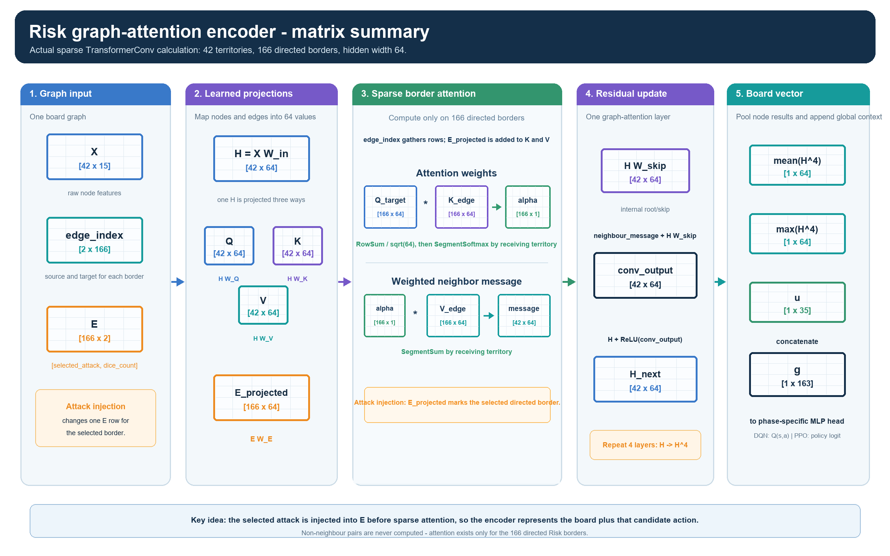

# Poster design brief — Risk graph-attention reinforcement learning

This is the production brief for an **A0 landscape** scientific poster. It is
not final artwork. It gives the poster one clear story, uses every prepared
visual, and deliberately reserves space for the DQN, PPO, and Dueling DQN
result plots.

## The one idea a reader should remember

> **Instead of predicting from one enormous fixed action space, the system
> injects each legal Risk move into the board graph and scores that
> state–action graph with one shared graph-attention encoder.**

## Poster header

**Title**

> **Learning to Play Risk with Action-Injected Graph Neural Networks**

**Subtitle**

> A shared graph-attention encoder scores legal moves across trade-in,
> reinforce, attack, occupy, and fortify phases.

Gilad Markman · Practical Deep Learning for Science · 2026

Keep the header visually simple. The figures should carry the technical story.

---

## A0 landscape layout

Use a visual-first upper half, a full-width results band, and a compact footer.
The results band must stay large enough for two or three final plots.

~~~text
┌──────────────────────────────── Header: title + one-sentence claim ────────────────────────────────┐
├───────────────────────┬────────────────────────────────────┬───────────────────────────────────────┤
│ 1. Risk as a graph    │ 2. Main idea: inject a legal action │ 3. Shared GNN + phase-specific heads  │
│ board screenshot      │ action-injected graph               │ network architecture figure             │
│ board-to-graph map    │                                    │                                       │
├───────────────────────┴────────────────────────────────────┴───────────────────────────────────────┤
│ Player-selection UI + short opponent roster     │ Technical inset: sparse attention matrix summary    │
├──────────────────────────────────────── Results: full-width comparison at matched data budget ─────┤
│ Largest: DQN / Dueling DQN / PPO win-rate curve │ held-out evaluation │ optional behaviour/diagnostic │
├──────────────────────────────────── Footer: conclusion · limits · QR · citations ──────────────────┤
└────────────────────────────────────────────────────────────────────────────────────────────────────┘
~~~

| Region | Share | Job |
|---|---:|---|
| Header | 9% | Establish question and novelty. |
| Game + method visuals | 43% | Explain the representation before the results. |
| UI + technical inset | 14% | Add context without breaking the main reading path. |
| Results | 26% | Final algorithm comparison. |
| Footer | 8% | Conclusion, limits, QR, citations. |

Use blue/grey for the base board and **orange only for injected candidate
actions**. Use consistent learner colours on every result chart:

| Learner | Chart colour |
|---|---|
| DQN | blue |
| Dueling DQN | purple |
| PPO | teal |

Do not reuse orange for an algorithm curve.

---

## 1. Risk is a graph of legal choices

### Reader-facing copy

Risk is a connected world map whose state changes every turn: territory
ownership, armies, continents, cards, reinforcement budget, and phase. The
game rules enumerate the moves that are legal now. The learner therefore
chooses among executable actions instead of scoring a fixed list dominated by
illegal moves.

### Figures 1 and 2 — board to graph

Place these together at the top of the left column. They should read as one
transformation: *playable board → graph representation*.

> **Figure 1.** The playable Risk board. A decision depends on local armies,
> ownership, continents, and adjacent territories.

> **Figure 2.** The same board as a graph: 42 territory nodes and 83
> undirected borders, stored as 166 directed edges for message passing.

Use this compact callout beside the map instead of a large feature table:

~~~text
X: node features       [42 × 15]
E: edge features       [166 × 2]
u: global features     [1 × 35]
~~~

The topology stays fixed; feature values change with the board state and the
candidate action.

---

## 2. A controlled environment supplies legal actions

### Reader-facing copy

The environment owns Risk rules and legal-action validation. At each decision,
it exposes the state and valid actions for the current phase; the agent chooses
one; the environment applies the move, opponents respond, and it returns the
next state, reward, and terminal signal. Heuristic and learning agents all use
this same interface.

### Figure 3 — player-selection UI and opponent roster

Use this as a small contextual inset below the board/map pair. It establishes
that the project contains a playable environment, not only a model.

> **Figure 3.** The start screen selects human, heuristic, and learning agents
> through the same game interface.

Place the roster immediately beside or below the UI:

| Agent | What it emphasizes |
|---|---|
| Random | Uniformly samples a legal move. |
| Raider | Aggressive expansion and marginal-odds attacks. |
| Sentinel | Border defence and safer attacks. |
| Empire | Capturing and protecting continents. |
| Killbot | Continent strategy plus weak-player elimination. |

---

## 3. The central idea: inject the candidate action into the graph

### Reader-facing copy

Risk has a variable, combinatorial action space. An attack chooses a source, a
neighbouring target, and dice; reinforcement, occupy, and fortify also choose
territories and army amounts. The rules create only legal candidates, then the
network scores every candidate in its board context.

For an attack, the selected directed border receives an orange edge feature
such as <code>[attack = 1, dice = 2/3]</code>. For reinforce, occupy, and
fortify, affected territory rows receive a proposed army-change feature. Skip
actions use an unmodified graph copy. The network therefore sees **the board
plus the specific candidate move**.

### Figure 4 — action-injected graph (hero method visual)

Make this the largest figure in the upper-middle column. Do not shrink it
below roughly one quarter of the poster width; its node, edge, and global
feature examples must remain readable.

> **Figure 4.** One legal attack changes the selected border before graph
> attention. Node features describe territories, edge features describe
> borders and attacks, and global features describe phase-level constraints.

If labels are needed beside the image, use only these three:

1. **Rules enumerate legal candidate actions.**
2. **Injection marks one candidate action in the graph.**
3. **The GNN returns one score for that state–action graph.**

---

## 4. One shared graph encoder, five action-phase heads

### Reader-facing copy

Every legal candidate enters the same graph-attention encoder. Four residual
<code>TransformerConv</code> layers exchange information along Risk borders,
so a territory can weigh different neighbours differently. Mean and max pooling
summarize territory embeddings, global state is appended, and the current phase
chooses one small MLP head. The representation is shared while the learning
objective changes.

### Figure 5 — network architecture

Place this directly to the right of Figure 4. It is the second-largest method
visual.

> **Figure 5.** A legal action becomes one graph row. The shared encoder is
> followed by the relevant trade-in, reinforce, attack, occupy, or fortify
> head. DQN treats the scalar as <code>Q(s, a)</code>; a policy learner uses
> legal action logits and a value estimate.

Keep this comparison small, near the lower part of the network figure:

| Learner | Legal-action output | Training signal |
|---|---|---|
| DQN | <code>Q(s, a)</code> | replayed Double-DQN targets |
| Dueling DQN | state value + relative advantage | replayed Double-DQN targets |
| PPO | policy logit and state value | on-policy clipped updates |

---

## 5. Technical inset: sparse graph attention

This figure is deliberately secondary. Put it beneath Figures 4–5, spanning
the middle/right of the poster. It answers “where does the injected edge enter
the calculation?” without forcing every reader through a long derivation.

> **Figure 6.** Attention is computed only on 166 directed Risk borders. The
> selected attack changes one projected edge row, which changes attention and
> the neighbour message for that candidate graph.

Do not duplicate its matrix labels in body text; the image is the explanation.

---

## 6. Results: compare learners at a matched data budget

Make this a full-width band. Do not replace it with prose before the final
charts exist: the reader should answer “does this representation learn to
play?” at a glance.

### Experimental protocol strip

Place this directly above the charts:

~~~text
Same legal-action generator  •  Same injected graph representation
Same heuristic-opponent roster  •  Randomized learner seat and player count
Compare against cumulative learner turns  •  Report held-out evaluation separately
~~~

The main x-axis must be **cumulative learner turns** (or another explicitly
reported measure of processed environment data). Do not headline raw optimizer
steps: PPO and DQN-family methods consume different batch sizes and data
schedules.

### Result Figure A — main comparison (required, largest)

Reserve about half of the results band:

~~~text
Rolling training win rate vs cumulative learner turns
Curves: DQN · Dueling DQN · PPO
~~~

> **Figure 7.** Rolling training win rate under the shared graph and opponent
> protocol. The horizontal axis represents interaction data, not optimizer
> updates.

### Result Figure B — held-out evaluation (required)

Reserve about one quarter of the results band:

~~~text
Balanced held-out evaluation win rate at matched training budgets
DQN · Dueling DQN · PPO, with uncertainty bars and number of games stated
~~~

> **Figure 8.** Held-out evaluation separates noisy learning-time outcomes
> from the final policy comparison. State the number of evaluation games and
> show uncertainty intervals.

### Result Figure C — optional supporting evidence

Use the final quarter only if it tells a different story:

~~~text
Territories conquered or agent-turn survival vs learner turns
~~~

This can show strategic improvement before it becomes wins. If it is not
useful, enlarge Figures 7–8 or add a compact evaluation table. Do not headline
shaped reward alone; it is an exploration signal, not the final objective.

### Results wording rule

Do not make a winner claim until held-out evaluation is complete.

| Evidence | Safe poster wording |
|---|---|
| Stronger training curve only | “Shows faster learning under this training protocol.” |
| Higher held-out win rate with uncertainty | “Achieved the strongest measured evaluation performance.” |
| Better behaviour but lower win rate | “Shows partial strategic improvement, but has not yet converted it into wins.” |

---

## Footer

### Take-home message — large type

> **Action injection converts a changing legal-action set into a graph scoring
> problem: the GNN evaluates the board and the proposed move together.**

### Limitations

- Risk outcomes are stochastic, so show held-out evaluation and uncertainty,
  not only a smoothed training curve.
- One injected graph per legal candidate is expressive but computationally more
  costly than a single fixed action-output layer.
- Compare DQN, Dueling DQN, and PPO only at matched training budgets and under
  the same opponent protocol.

### Footer items

- Repository QR code and experiment-tracking QR/link.
- Course and author line.
- Compact citations for DQN/Double DQN, Dueling DQN, PPO, GAT, and
  PyTorch-Geometric <code>TransformerConv</code>.

---

## Production rules

1. Use the original high-resolution assets listed below, **not** the
   <code>*_poster.png</code> preview copies.
2. Keep Figure 4 as the hero method figure. Figures 5–6 follow it; they should
   not compete with it.
3. Export final W&B plots as SVG/PDF when possible, otherwise a
   high-resolution PNG without W&B interface chrome.
4. Use the same DQN, Dueling DQN, and PPO colours in every plot and legend.
5. Put axes, evaluation-game count, and uncertainty directly on each chart.
6. Use body text around 28–32 pt, captions at least 22 pt, headings 44–56 pt,
   and title 90–110 pt. Check readability at 1–1.5 m.
7. Before printing, replace every result placeholder with a reproducible,
   selected comparison window. Do not retain unsupported preliminary claims.

### Asset register

| Asset | Poster role |
|---|---|
| <code>Assets/RiskMap/image.png</code> | Game board introduction |
| <code>Assets/RiskMap/map_graph_nodes_edges.png</code> | Board-to-graph transformation |
| <code>Assets/RiskMap/start UI.png</code> | Player-selection and agent-interface context |
| <code>Assets/RiskMap/partial_graph_attributes.png</code> | Main action-injection explanation |
| <code>Assets/RiskMap/network_phase_heads_v2.png</code> | Shared encoder and five heads |
| <code>Assets/encoder_matrix_summary.png</code> | Secondary sparse-attention technical inset |
